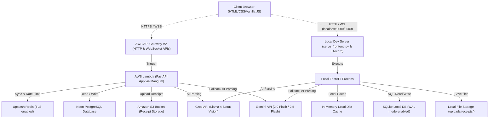
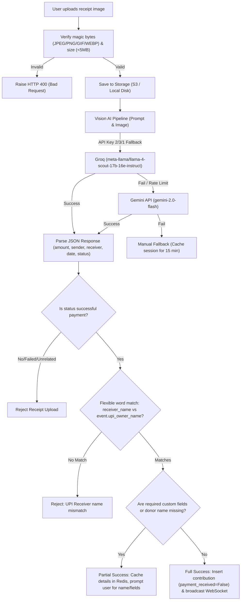

# System Architecture & Request Lifecycle

> [!IMPORTANT]
> **Code is the Source of Truth**: If this documentation differs from the implementation in the codebase, the implementation always wins.

This document describes the architectural layout, request lifecycles, real-time message broadcasting synchronization, and the AI receipt extraction pipeline of Notepay.

---

## 🏗️ High-Level System Architecture

Notepay is engineered to support dual execution environments: a local development mode with low latency and zero overhead, and an AWS serverless production mode designed for scale and cost-efficiency.



---

## 🔄 Request Lifecycle

The lifecycle of an HTTP request transitions through the following stages:

```
[Client Fetch] ---> [API Gateway / Uvicorn] ---> [Mangum / ASGI Middleware]
                                                            |
[SQLAlchemy ORM] <-- [CRUD Queries] <-- [Auth / Role Gate] <-- [FastAPI Router]
       |
[Neon / SQLite]
```

1.  **Transport & Routing**:
    *   **Production**: The client triggers HTTPS/REST calls routed via Amazon Route 53 to an AWS API Gateway V2 HTTP API. API Gateway forwards the raw proxy payload to the main AWS Lambda function.
    *   **Local**: Requests are received directly by the Uvicorn web server running on port `8000`.
2.  **ASGI Middleware Adaptation**:
    *   In production, the **Mangum** adapter catches the Lambda payload, translates it into standard ASGI connection dictionaries, and invokes the **FastAPI** application.
    *   Global middlewares inspect requests: CORS validation checks origins (`_ALLOWED_ORIGINS` holds production and common local development addresses), and exception handlers prevent failures from stripping CORS headers (using a custom global exception handler that returns structured `JSONResponse` objects with standard status codes).
3.  **Authentication & Security Gates**:
    *   FastAPI routes enforce dependency injections: `get_current_user_id` or `get_optional_current_user_id`.
    *   The Bearer token (JWT) is extracted from the `Authorization` header.
    *   The backend verifies the token cryptographically against Firebase Admin SDK.
    *   **Performance Optimization**: Token verification is cached in a local in-memory dictionary (`_local_token_cache`) mapping token hashes to decoded results with a 10-minute expiry, bypassing Network / API latency on subsequent calls.
    *   **Clock Skew Mitigation**: If Firebase claims the token was "used too early" (which happens due to minor clock drifts between AWS Lambda and Firebase servers), the validator catches the exception, sleeps for 2 seconds, and retries up to 3 times before rejecting the request.
4.  **Authorization & Access Gates**:
    *   Routes verify membership and permissions using `verify_membership` or `verify_event_active_for_collector`.
    *   Permissions are enforced as follows:
        *   **Organizer**: Full access to edit, delete, and restrict members.
        *   **Collector**: Can read finances, write transactions, and edit/delete *only their own* transactions.
        *   **Restricted**: Blocked from all read and write endpoints.
        *   **Visitor**: Read-only access to public events (active memberships are not required, but writes are blocked).
5.  **Database Connection Execution**:
    *   **Neon Postgres (Prod)**: Creates an engine tuned with a custom `QueuePool` size of `1` and `max_overflow=2` to ensure that each serverless Lambda container maintains exactly *one* persistent database connection, avoiding Neon CPU connection depletion.
    *   **SQLite (Dev)**: Configured with `connect_args={"check_same_thread": False}` and triggers immediate database events setting `PRAGMA journal_mode=WAL` and `PRAGMA synchronous=NORMAL` to bypass local OneDrive synchronization write-locks.

---

## ⚡ WebSocket Flow & Real-Time Sync

To keep ledger states in sync across multiple mobile and desktop displays without expensive polling, Notepay runs a dual-mode WebSocket synchronization model.

```mermaid
sequenceDiagram
    autonumber
    actor Client as Client Browser
    participant API as API Gateway / WS Server
    participant Redis as Upstash Redis Cache
    participant DB as Backend Database
    participant APIGW as Boto3 APIGw Management API

    Client->>API: Connect to WebSocket (/ws/dashboard or /ws/{event_id})
    API->>Client: Connection Accepted
    Client->>API: Send AUTH message {"type": "AUTH", "token": "Firebase JWT"}
    Note over API,DB: Backend decodes JWT & maps firebase_uid to user_id
    API->>Client: Send {"type": "AUTH_OK"} (Badge turns green)
    
    rect rgb(30, 40, 50)
        Note over API,Redis: If in production (Serverless)
        API->>Redis: Register connection: SADD ws:evt:{event_id} (ConnectionId)
        API->>Redis: Set connection mapping: SET ws:conn:(ConnectionId) -> evt:{event_id}
    end

    Note over Client,DB: User triggers a transaction write (e.g. Add Contribution)
    Client->>API: POST /events/{event_id}/contributions
    API->>DB: INSERT Contribution Record
    API->>API: Trigger broadcast_change()
    
    rect rgb(30, 40, 50)
        Note over API,Redis: Production (Boto3 Broadcast)
        API->>Redis: SMEMBERS ws:evt:{event_id} -> returns active ConnectionIds
        loop For each ConnectionId in Parallel (ThreadPoolExecutor)
            API->>APIGW: post_to_connection(ConnectionId, Message)
            APIGW-->>Client: Push {"type": "CONTRIBUTION_ADDED", "data": {...}}
        end
    end
    
    rect rgb(20, 50, 20)
        Note over API: Local (In-Memory Broadcast)
        loop For each WebSocket object in active_connections[event_id]
            API-->>Client: Push json message in-memory
        end
    end
```



### Serverless WebSocket Broadcasts
In an AWS Lambda serverless execution context, containers are short-lived, isolated, and cannot share in-memory lists of active WebSocket connections. Notepay solves this as follows:
1.  **State Registry**: When a client connects via AWS API Gateway V2 WebSocket API, the connection triggers the Lambda handler's `$connect` route.
2.  **Authentication**: The client sends an `AUTH` message payload containing their JWT token. The backend verifies the token and stores the `connectionId` in **Upstash Redis** inside event-specific sets (e.g., `ws:evt:{event_id}`) and dashboard sets (`ws:dash`).
3.  **Asynchronous Push**: When a write occurs (e.g., a collector adds an expense), the API handler calls `manager.broadcast_change()`. 
4.  **Parallel Execution**: The backend reads active connections from Redis and uses `boto3` client `apigatewaymanagementapi` to push messages back to API Gateway connections. To prevent slow sequential HTTP requests from blocking the Lambda process, connections are notified in parallel using a python `ThreadPoolExecutor` with `max_workers=10`.
5.  **Pruning Dead Connections**: If a `post_to_connection` call fails (indicating the client disconnected), that connection ID is marked as dead and immediately removed from the Redis set.

---

## 📷 AI Receipt Validation Pipeline

The AI Receipt verification pipeline automatically extracts data from payment screenshot images and matches them against event criteria:



### 1. File Validation
Before invoking expensive AI models, the `storage_service` performs content checks:
*   **File Size**: Enforces a strict 5MB maximum limit.
*   **Magic Byte Signature Verification**: The service inspects the file's first bytes to guarantee the image is a valid JPEG (`\xff\xd8\xff`), PNG (`\x89PNG\r\n\x1a\n`), GIF (`GIF8`), or WEBP (`RIFF`) format, blocking malicious payloads or non-image types.

### 2. Multi-Model AI Vision Failover
To guarantee uptime, the extraction routing layer checks and falls back through models:
*   **Primary Engine**: Groq Vision utilizing `meta-llama/llama-4-scout-17b-16e-instruct` (checks three environment API keys sequentially to handle API key rate limits).
*   **Secondary Engine**: If Groq is rate-limited or fails, the pipeline catches the error and queries Google Gemini using the `gemini-2.0-flash` model.
*   **Third-tier Fallback**: If all AI calls fail, the system issues a temporary `receipt_session_id`, cache-maps the receipt key in Redis, and redirects the user to fill out transaction details manually.

### 3. Receiver Name Matching
The backend sanitizes both the extracted `receiver_name` and the event's `upi_owner_name` by removing non-alphanumeric characters and converting strings to lowercase. It marks it a valid match if:
*   The sanitized strings match exactly or one is a substring of the other (e.g., `bodamohanreddy` and `mohanreddyboda`).
*   They share significant words of length > 2 (e.g., matching first and last names while skipping middle initials).
If no match is found, the payment is rejected (blocking uploads of receipts made to unrelated UPI accounts).

### 4. Custom Fields & Completion Gates
*   **Full Success**: If the donor name is extracted successfully and the event has no custom columns marked as `reqByDonor` (required by donor), the transaction is written immediately as a contribution with `payment_received=False` (unreconciled status), and WS clients are notified.
*   **Partial Success**: If the donor name is missing or the event contains columns the donor must fill out, a temporary session is cached in Redis for 15 minutes. The user is prompted to enter their name and required fields, which are submitted via `/submit_manual_contribution` to complete the transaction.

---

## 🛠️ Code Linkage & Implementation Reference

*   **FastAPI & Mangum Entry Handler**: [backend/main.py](file:///c:/Users/bodha/OneDrive/Documents/NOTEPAY/Notepay_App/backend/main.py) (Function: `handler`, Router mapping: `main.app`)
*   **WebSocket Connection Manager**: [backend/ws_manager.py](file:///c:/Users/bodha/OneDrive/Documents/NOTEPAY/Notepay_App/backend/ws_manager.py) (Class: `WebSocketManager`, Connection Broadcast: `broadcast_change()`, Client Handshake: `connect()`)
*   **API Auth Validation Guards**: [backend/auth.py](file:///c:/Users/bodha/OneDrive/Documents/NOTEPAY/Notepay_App/backend/auth.py) (Function: `verify_token()`, Local Auth Cache: `_local_token_cache`)
*   **Role Permission Guards**: [backend/dependencies.py](file:///c:/Users/bodha/OneDrive/Documents/NOTEPAY/Notepay_App/backend/dependencies.py) (Functions: `verify_membership()`, `verify_event_active_for_collector()`)
*   **Receipt Verification Handler**: [backend/routers/public.py](file:///c:/Users/bodha/OneDrive/Documents/NOTEPAY/Notepay_App/backend/routers/public.py) (Function: `upload_receipt()`, Image Validation: `validate_receipt_content()`)

---

## 🔗 Related Documentation
*   👉 **[Frontend Client Architecture Guide](frontend.md)**
*   👉 **[Backend Service Configuration Guide](backend.md)**
*   👉 **[Database Layout & Aggregations Guide](database.md)**
*   👉 **[AI Processing & Prompts Guide](ai.md)**
