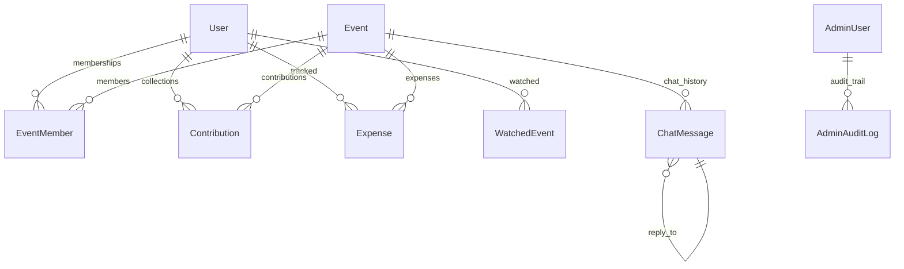

# Database Schema & Aggregation Architecture

> [!IMPORTANT]
> **Code is the Source of Truth**: If this documentation differs from the implementation in the codebase, the implementation always wins.

*   **Database Schema Models**: [backend/models.py](file:///c:/Users/bodha/OneDrive/Documents/NOTEPAY/Notepay_App/backend/models.py)
*   **Database Session Manager**: [backend/database.py](file:///c:/Users/bodha/OneDrive/Documents/NOTEPAY/Notepay_App/backend/database.py)
*   **SQL Aggregation Queries**: [backend/crud.py](file:///c:/Users/bodha/OneDrive/Documents/NOTEPAY/Notepay_App/backend/crud.py) (Function: `_build_event_aggregates()`)
*   **Alembic Database Configurations**: [backend/alembic.ini](file:///c:/Users/bodha/OneDrive/Documents/NOTEPAY/Notepay_App/backend/alembic.ini)

---

## 🛠️ Database Engine Optimization

### 1. SQLite WAL Mode (Local Development)
To prevent local file locking errors caused by OneDrive, background file syncs, or concurrent FastAPI requests, the engine automatically configures SQLite on connection:
```python
@event.listens_for(engine, "connect")
def set_sqlite_pragma(dbapi_connection, connection_record):
    cursor = dbapi_connection.cursor()
    cursor.execute("PRAGMA journal_mode=WAL") # Write-Ahead Logging
    cursor.execute("PRAGMA synchronous=NORMAL") # Reduce disk flush frequency
    cursor.close()
```
*   **WAL Mode**: Writes modifications to a separate `-wal` file instead of locking the main database file, allowing concurrent reads while writing.
*   **Normal Sync**: Speeds up disk writes, resolving locks and performance issues in local developer directories.

### 2. Connection Pool Tuning (Production Serverless Neon)
Standard databases expect persistent connection pools. However, in serverless environments, AWS Lambda scales horizontally, spawning hundreds of short-lived containers. If each container creates a default pool size of 5–10 connections, the database will exhaust its connection limit.

To prevent Neon database connection exhaustion, Notepay limits the pool size:
```python
from sqlalchemy.pool import QueuePool

engine = create_engine(
    SQLALCHEMY_DATABASE_URL,
    poolclass=QueuePool,
    pool_size=1,        # Exactly 1 persistent connection per Lambda container
    max_overflow=2,     # Allow up to 2 temporary connections on burst traffic
    pool_pre_ping=True  # Ping connection before query to recycle dead sockets
)
```
*   **Why pool_size=1?** An AWS Lambda container executes exactly one request at a time. Therefore, a container never needs more than one active connection, saving connection overhead.
*   **Pre-ping**: Bypasses connection dropped errors caused by serverless database firewalls.

---

## 📂 Entity Models & Schema Specs

The database models are defined in [models.py](file:///c:/Users/bodha/OneDrive/Documents/NOTEPAY/Notepay_App/backend/models.py):



### 1. User (`users`)
Stores user profiles and account status.
*   `id` (Integer, Primary Key, Indexed)
*   `firebase_uid` (String, Unique, Indexed)
*   `phone_number` (String, Unique, Indexed)
*   `full_name` (String, Indexed)
*   `gender` (Enum: `Male`, `Female`, `Prefer not to say`)
*   `created_at` (DateTime, Default: UTC Now)
*   `is_banned` (Boolean, Default: False)
*   `ban_reason` (String, Nullable)

### 2. Event (`events`)
Stores event configuration, invite codes, and dynamic columns.
*   `id` (String(32), Primary Key, UUID Hex, Default: `uuid.uuid4().hex`)
*   `name` (String, Indexed)
*   `description` (String)
*   `event_date` (DateTime, Indexed)
*   `invite_code` (String, Unique, Indexed)
*   `is_active` (Boolean, Default: True, Indexed)
*   `is_public` (Boolean, Default: False, Indexed)
*   `organizer_id` (Integer, Foreign Key `users.id`, Indexed)
*   `upi_id` (String, Nullable)
*   `upi_owner_name` (String, Nullable)
*   `upi_verified_at` (DateTime, Nullable)
*   `show_contributions` (Boolean, Default: True)
*   `show_expenses` (Boolean, Default: True)
*   `goal_amount` (Integer, Default: 0)
*   `contribution_custom_columns` (JSON, Array of objects defining custom fields)
*   `expense_custom_columns` (JSON, Array of objects defining custom fields)

### 3. Event Member (`event_members`)
Associates users to events with roles.
*   `id` (Integer, Primary Key)
*   `user_id` (Integer, Foreign Key `users.id`, Indexed)
*   `event_id` (String(32), Foreign Key `events.id`, Indexed)
*   `role` (Enum: `Organizer`, `Collector`, Indexed)
*   `joined_at` (DateTime)
*   `is_restricted` (Boolean, Default: False)
*   `restricted_at` (DateTime, Nullable)
*   **Database Constraints & Indexes**:
    *   `idx_event_members_user_event`: Composite unique index on `(user_id, event_id)`. Prevents duplicate memberships.
    *   `idx_event_members_user_role`: Composite index on `(user_id, role)`. Speeds up dashboard queries filtering for My Events vs. Shared Events.

### 4. Contribution (`contributions`)
Logs payment transactions.
*   `id` (Integer, Primary Key)
*   `event_id` (String(32), Foreign Key `events.id`, Indexed)
*   `donor_name` (String, Indexed)
*   `amount` (Float)
*   `collected_by` (Integer, Foreign Key `users.id`, Indexed)
*   `collected_at` (DateTime, Default: UTC Now, Indexed)
*   `custom_fields` (JSON, Dict holding dynamic columns)
*   `receipt_key` (String, Nullable)
*   `version` (Integer, Default: 1)
*   `is_public_entry` (Boolean, Default: False)
*   `payment_received` (Boolean, Default: True)
*   **Indexes**:
    *   `idx_contributions_event_collected_at`: Composite index on `(event_id, collected_at)`. Speeds up date sorting for transaction timelines.
    *   `idx_contributions_event_payment`: Composite index on `(event_id, payment_received)`. Speeds up sum calculations of paid vs. pending contributions.

### 5. Expense (`expenses`)
Logs expenditures.
*   `id` (Integer, Primary Key)
*   `event_id` (String(32), Foreign Key `events.id`, Indexed)
*   `description` (String, Indexed)
*   `amount` (Float)
*   `collected_by` (Integer, Foreign Key `users.id`, Indexed)
*   `collected_at` (DateTime, Default: UTC Now, Indexed)
*   `custom_fields` (JSON, Dict holding dynamic columns)
*   `receipt_key` (String, Nullable)
*   `version` (Integer, Default: 1)
*   **Indexes**:
    *   `idx_expenses_event_collected_at`: Composite index on `(event_id, collected_at)`.

### 6. Watched Event (`watched_events`)
Tracks public event preview history for users.
*   `id` (Integer, Primary Key)
*   `user_id` (Integer, Foreign Key `users.id`, Indexed)
*   `event_id` (String(32), Foreign Key `events.id`, Indexed)
*   `last_viewed_at` (DateTime, Default: UTC Now, Indexed)
*   **Indexes**:
    *   `idx_watched_events_user_event`: Composite unique index on `(user_id, event_id)`.

### 7. Chat Message (`chat_messages`)
Stores communication logs.
*   `id` (Integer, Primary Key)
*   `event_id` (String(32), Foreign Key `events.id`, Indexed)
*   `user_id` (Integer, Foreign Key `users.id`, Nullable - Null indicates system/AI Advisor)
*   `message` (String, Max length 2000)
*   `reply_to_id` (Integer, Foreign Key `chat_messages.id`, Nullable)
*   `reactions` (JSON, Dict mapping emojis to arrays of user IDs)
*   `delivered_to` (JSON, Array of user IDs)
*   `read_by` (JSON, Array of user IDs)
*   `sent_at` (DateTime)
*   **Indexes**:
    *   `idx_chat_messages_event_id_id`: Compound index on `(event_id, id)`. Optimized for scroll-up cursor pagination (`WHERE id < before_id`).

### 8. System Entities
*   `AdminUser`: Email, Name, password hash, role, and created timestamp.
*   `AdminAuditLog`: Tracks administrative operations (actions, target entity IDs, details, timestamps).
*   `Feedback`: User feedback submissions (name, email, type, message, status, timestamps).
*   `ErrorLog`: Endpoint paths, error messages, and tracebacks for debugging server failures.

---

## ⚡ Optimized SQL Aggregation Strategy (No N+1)

Standard ORM code frequently queries child records (like contributions) within Python loops, leading to N+1 database round-trips. Notepay prevents this by using optimized database queries.

### Aggregate Event Metrics Query
To load All Events, My Events, and Shared Events on the dashboard, the backend calculates totals inside `_build_event_aggregates(db, event_ids)` using three focused `GROUP BY` database queries:
1.  **Contributions Aggregation**:
    ```sql
    SELECT 
        event_id,
        SUM(amount) AS total_paid,
        SUM(CASE WHEN payment_received = 0 THEN amount ELSE 0 END) AS total_pending
    FROM contributions
    WHERE event_id IN (:event_ids)
    GROUP BY event_id;
    ```
2.  **Expenses Aggregation**:
    ```sql
    SELECT event_id, SUM(amount) AS total_expenses
    FROM expenses
    WHERE event_id IN (:event_ids)
    GROUP BY event_id;
    ```
3.  **Member Count Aggregation**:
    ```sql
    SELECT event_id, COUNT(id) AS member_count
    FROM event_members
    WHERE event_id IN (:event_ids)
    GROUP BY event_id;
    ```
These queries calculate financial aggregates entirely inside the database engine. The backend compiles the results in a Python dictionary in $O(1)$ database round-trips.

---

## 🔄 Database Migrations (Alembic)

Database schema modifications are managed via **Alembic**:
*   **Configuration**: Configured via `backend/alembic.ini`. The migration history scripts reside inside the `backend/migrations` folder.
*   **Creating Migrations**: Run the command from the `/backend` folder:
    ```bash
    alembic revision --autogenerate -m "description_of_change"
    ```
*   **Running Migrations**: Apply migrations locally using:
    ```bash
    alembic upgrade head
    ```
*   **Production Migrations**: Handled automatically during CI/CD deployments by executing the upgrade command prior to updating the AWS Lambda function.
