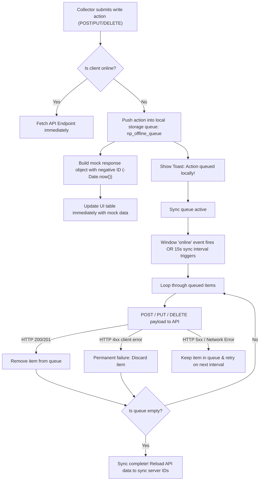

# Frontend Architecture & Client-Side Mechanics

> [!IMPORTANT]
> **Code is the Source of Truth**: If this documentation differs from the implementation in the codebase, the implementation always wins.

Notepay's frontend is designed for speed, clarity, and mobile-friendly layouts. It is built using standard browser APIs: **HTML5, Vanilla CSS, and Modern Vanilla JavaScript**, avoiding framework compilation overhead (such as React, Vue, or build-bundlers).

---

## 🎨 Single Page Application (SPA) Routing & Layouts

To create an app-like navigation experience, Notepay uses an in-page SPA panel switching model.

### 1. Dashboard View Management
The `dashboard.html` serves as a master layout. Navigating between views is controlled by `switchSPAView(viewName)` and `switchTab(tabIndex)` in [dashboard.js](../frontend/js/dashboard.js):
*   **SPA Panels**: The UI displays panels using `class="spa-panel"` and toggles visibility by adding or removing a `.hidden` class.
*   **Active Tab Memory**: The active dashboard tab index (All Events = 0, My Events = 1, Shared Events = 2, Visited Events = 3) is saved in `localStorage.setItem('np_dash_tab', tabIndex)`. On page reload, the script restores the active tab from cache.

### 2. Dual-Mode URL Translation
To support clean URLs in production while allowing simple local double-click file execution, [shared-utils.js](../frontend/js/shared-utils.js) implements a dual-mode router:
*   **Local Routing**: If the host is detected as `localhost`, `127.0.0.1`, or uses the `file:` protocol, URLs are translated to legacy format with query strings (e.g., `event.html?id=ABCD123&tab=don`).
*   **Production Routing**: In production, absolute clean URLs are built (e.g., `/event/ABCD123/collections`).
*   **Path Parser**: The function `parseCurrentPath()` parses paths and extracts event IDs and active sub-tabs:
    ```javascript
    // Example path: /event/ABCD123/collections
    // Returns: { page: "event", id: "ABCD123", sub: "collections", tab: "don" }
    ```

---

## 🧱 Custom Web Components

Shared visual interfaces are structured as standard HTML Web Components (Custom Elements) defined inside [components.js](../frontend/js/components.js):

### 1. `<np-sidebar>` Web Component
*   **Dynamic Data Syncing**: The sidebar element parses event counts stored in `np_event_counts` cache, updating counts dynamically in navigation tags.
*   **Profile Avatars**: It automatically resolves the user profile name via `np_dash_cache` and sets initials and unique avatar colors.
*   **Active Link Highlighting**: On initialization (`connectedCallback`), the component matches the current URL path against links to apply the `.active` style.

### 2. Avatar Initial Formatting
Avatars are generated dynamically from names using:
*   `getInitials(name)`: Trims and splits strings on whitespace, extracting the first letter of the first two words (e.g., "Boda Mohan Reddy" → "BM").
*   `getAvatarColor(name)`: Hashes character codes to return a consistent background color from a curated palette of 8 Tailwind-matched HSL values.

---

## 🔒 Session Auth & Authentication Caching

Client-side security is managed by Firebase Auth and custom gates:

### 1. Delayed IndexedDB Auth Restoration
On page load, Firebase occasionally fires a `null` user event briefly before restoring the user session from IndexedDB. To prevent redirecting logged-in users back to the login page (known as redirect loops), [firebase-config.js](../frontend/js/firebase-config.js) implements:
*   `waitForAuthReady()`: A promise wrapper that waits up to 3.5 seconds when Firebase fires `null` to see if a valid user object is restored. If a user object is found, it resolves immediately; if not, it resolves to `null` after the timeout.

### 2. JWT ID Token Cache
Requesting a fresh auth token on every REST request creates network latency. Notepay caches tokens locally:
*   `getIdToken()`: Resolves a cached token in memory (`_cachedToken`) if the timestamp has not exceeded 50 minutes. If expired, it triggers Firebase's `user.getIdToken(false)` to fetch a fresh token.

### 3. FOUC Prevention & Route Guards
Protected pages include the [auth-guard.js](../frontend/js/auth-guard.js) script at the top:
*   **Loading Splash**: If it is an external navigation request, the guard injects a full-screen loading spinner and sets the HTML style to `visibility: hidden !important` to block the rendering of protected data.
*   **Internal Nav Optimization**: If navigating internally within the app, the splash is skipped (using `sessionStorage.getItem('np_session_active') === 'true'`) to make transitions instant and smooth.
*   **New User Profile Redirect**: If the user has just registered (`np_new_user` is true) and has not completed setup, the guard forces a redirect to `profile-setup.html`.

---

## ⚡ Smart Offline Sync Queue

Notepay features an optimistic offline writing queue that allows collectors to log payments and expenses in areas with poor internet connectivity.



### 1. Action Queuing & Optimistic Rendering
When an API request (POST/PUT/DELETE) is fired and the network is offline:
1.  **Queue Insertion**: The write is intercepted by `handleOfflineWrite()` inside [api.js](../frontend/js/api.js).
2.  **Payload Logging**: The request method, API path, body, and timestamp are saved in a JSON array in `localStorage.setItem("np_offline_queue", ...)`.
3.  **Mock IDs**: The queue generates a temporary ID using a negative timestamp (e.g., `-1719876543210`).
4.  **Optimistic Rendering**: The handler returns a mock transaction object containing the user's name and the offline ID. The UI page appends this mock transaction immediately, allowing visual progress without server round-trips.

### 2. Auto-Synchronization & Cleanup
*   **Immediate Sync**: A window listener watches for the `online` event to trigger `syncOfflineQueue()` immediately upon connection restoration.
*   **Battery-Optimized Polling**: A 15-second background interval (`_offlineSyncInterval`) triggers synchronization attempts. To conserve device CPU and battery life, the interval is stopped when the queue is empty and restarted only when a new action is queued.
*   **Error Tolerance**:
    *   **Server Failures (5xx / Network Timeout)**: The sync loop leaves the item in the queue to be retried later.
    *   **Permanent Client Rejections (4xx except 401)**: The item is discarded from the queue to prevent loop blockages.
*   **Server ID Reconciliation**: Once the queue is successfully cleared, a success toast is shown, and the application reloads data from the server, replacing all negative mock IDs with actual database primary keys.

---

## 🛠️ Code Linkage & Implementation Reference

*   **API Client & Offline Queue**: [frontend/js/api.js](../frontend/js/api.js) (Function: `syncOfflineQueue()`, Cache handling: `handleOfflineWrite()`)
*   **Auth Guard & Redirects**: [frontend/js/auth-guard.js](../frontend/js/auth-guard.js) (Guard handler block, Splash Injector)
*   **Firebase Integration**: [frontend/js/firebase-config.js](../frontend/js/firebase-config.js) (Function: `waitForAuthReady()`, Token Cache: `getIdToken()`)
*   **Web Components Layer**: [frontend/js/components.js](../frontend/js/components.js) (Class: `NpSidebar`, Method: `connectedCallback()`)
*   **URL & Format Utilities**: [frontend/js/shared-utils.js](../frontend/js/shared-utils.js) (Class: `NPUtils`, Helper: `parseCurrentPath()`, `buildUrl()`)

---

## 🔗 Related Documentation
*   👉 **[System Architecture & Design Map](architecture.md)**
*   👉 **[Design System Specifications Guide](design-system.md)**
*   👉 **[Testing & Local QA Guidelines](testing.md)**
*   👉 **[Coding Standards Handbook](coding_standards.md)**
