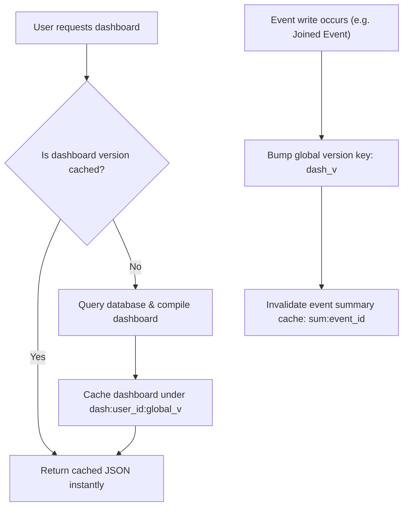

# System Performance & Resource Optimization

> [!IMPORTANT]
> **Code is the Source of Truth**: If this documentation differs from the implementation in the codebase, the implementation always wins.

*   **Database Query Optimization Layer**: [backend/crud.py](file:///c:/Users/bodha/OneDrive/Documents/NOTEPAY/Notepay_App/backend/crud.py) (Function: `_build_event_aggregates()`, `get_event_summary()`)
*   **Heartbeat version caching**: [backend/cache.py](file:///c:/Users/bodha/OneDrive/Documents/NOTEPAY/Notepay_App/backend/cache.py) (Class: `RedisCache`, Global Version: `bump_global_version()`)
*   **WebSocket Broadcast Multi-threading**: [backend/ws_manager.py](file:///c:/Users/bodha/OneDrive/Documents/NOTEPAY/Notepay_App/backend/ws_manager.py) (Parallel executors wrapper)

---

## 🏎️ Database Query Optimization (Avoiding N+1 Loops)

A common performance bottleneck in ORM applications is the **N+1 query problem**, where a parent record (e.g. an event) is queried first, and then child records (e.g. contributions) are queried inside a loop, causing excessive database round-trips. Notepay prevents this by using optimized queries:

### 1. Eager Loading
When loading lists of objects that require details from related tables (such as members and their user profiles), the backend uses SQLAlchemy's `joinedload()` option:
```python
members = db.query(models.EventMember).options(
    joinedload(models.EventMember.user)
).filter(models.EventMember.event_id == event_id).all()
```
This forces the ORM to perform a SQL `JOIN` operation, fetching all members and user details in a single query instead of executing separate queries for each member profile.

### 2. SQL Group By Aggregations
To load the event dashboard without querying full transaction lists for every event, the backend uses SQL aggregates (`_build_event_aggregates` inside `crud.py`). 
*   **Implementation**: Calculates payment sums, pending totals, and member counts inside the database engine using three `GROUP BY` queries.
*   **Result**: Reduces database load and memory usage, compiling dashboard stats in $O(1)$ database round-trips regardless of the number of events.

---

## ⚡ Caching & Invalidation Architecture

Notepay implements a cached dashboard system using **Upstash Redis** (with in-memory dictionary fallback):



### 1. Heartbeat Versioning (`dash_v`)
*   **Cache Keys**: Dashboards are cached under the key structure `dash:{user_id}:{global_version}`.
*   **Invalidation**: When an event is updated, created, or joined, the backend increments the global dashboard version key `dash_v` in Redis. This invalidates all cached dashboards instantly on the next request, ensuring users always see up-to-date data without complex cache purging routines.

### 2. Event Summary Cache
Financial overview statistics are cached under `sum:{event_id}`. This cache is invalidated selectively during transactions (such as adding or deleting a contribution), preventing unnecessary re-calculations on read-heavy summary pages.

---

## 📦 Memory Usage Constraints

To prevent memory leaks and out-of-memory (OOM) errors in containers, the backend enforces memory limits:
*   **AI Context Limits**: Aggregates event finances first, and restricts the raw transaction context sent to the AI model to the 200 most recent contributions and 100 most recent expenses.
*   **Chat Message Cap**: Capping event chat history to 250 messages. The backend runs a cleanup check 10% of the time during inserts to remove older messages.
*   **Local Cache Limits**: The fallback cache sweeps and deletes expired keys when size exceeds 5,000 items, and clears the cache entirely if size exceeds 8,000 items.

---

## ☁️ Serverless WebSocket Broadcasts

In production, WebSocket connections are managed by AWS API Gateway V2. To keep Lambda execution times low:
*   **Parallel Broadcasting**: The backend reads active connections from Redis and sends notifications in parallel using a python `ThreadPoolExecutor` with `max_workers=10`. This prevents slow sequential requests from blocking Lambda containers.
*   **Connection Pruning**: If a connection push fails, the connection ID is marked as dead and removed from the Redis set instantly, keeping sets clean.
