# Workflow: Event Chat & AI Advisor

> [!IMPORTANT]
> **Code is the Source of Truth**: If this documentation differs from the implementation in the codebase, the implementation always wins.

*   **Frontend Action**: [frontend/event.html](file:///c:/Users/bodha/OneDrive/Documents/NOTEPAY/Notepay_App/frontend/event.html) (Script: `js/controllers/EventChatController.js`)
*   **FastAPI Router Endpoint**: [backend/routers/chat.py](file:///c:/Users/bodha/OneDrive/Documents/NOTEPAY/Notepay_App/backend/routers/chat.py) (Function: `send_chat_message()`)
*   **AI Context Builder Worker**: [backend/routers/chat.py](file:///c:/Users/bodha/OneDrive/Documents/NOTEPAY/Notepay_App/backend/routers/chat.py) (Function: `process_ai_chat()`)
*   **Database CRUD Layer**: [backend/crud.py](file:///c:/Users/bodha/OneDrive/Documents/NOTEPAY/Notepay_App/backend/crud.py) (Function: `create_chat_message()`)
*   **WebSocket Broadcast Trigger**: [backend/ws_manager.py](file:///c:/Users/bodha/OneDrive/Documents/NOTEPAY/Notepay_App/backend/ws_manager.py) (Function: `broadcast_change()`)

---

## 🔄 Execution Sequence Diagram

```mermaid
sequenceDiagram
    autonumber
    actor User as Event Member
    participant FE as Frontend Chat Panel
    participant API as FastAPI Backend
    participant DB as SQLite / Neon DB
    participant WS as WebSocket Manager
    participant AI as AI Model (Groq/Gemini)

    User->>FE: Enters text & clicks "Send" (e.g. "@ai How much did we spend?")
    FE->>API: POST /events/{event_id}/chat (message, reply_to_id, idempotency_key)
    Note over API: Dependency: verify_membership (write check)
    API->>API: Check idempotency key (prevent duplicates)
    API->>DB: INSERT INTO chat_messages record
    API->>WS: Broadcast "NEW_CHAT_MSG" (User's message)
    
    alt Message starts with "@ai "
        API->>WS: Broadcast "AI_TYPING" (Typing indicator starts)
        Note over API: Start FastAPI BackgroundTask: process_ai_chat()
        API-->>FE: Return HTTP 200 (Success)
        
        rect rgb(30, 40, 50)
            Note over API,DB: Background Task Context Assembly
            API->>DB: SQL SUM totals & SELECT recent transactions
            API->>AI: Call API (Groq Llama-3, fallback to Gemini 2.5 Flash)
            AI-->>API: Returns AI Response Text
            API->>DB: INSERT INTO chat_messages record (sender_id = Null)
            API->>WS: Broadcast "NEW_CHAT_MSG" (AI Response message)
        end
    else Standard Message
        API-->>FE: Return HTTP 200 (Success)
    end
    
    WS-->>FE: Push live messages & update scroll position
```



---

## 🛠️ Detailed Component Actions

### 1. User Interaction (Frontend)
*   The user navigates to the event's detailed page, opens the **Chat** tab, enters text, and clicks send.
*   If the message starts with `@ai `, it is routed to the AI Advisor.
*   The page controller [EventChatController.js](file:///c:/Users/bodha/OneDrive/Documents/NOTEPAY/Notepay_App/frontend/js/controllers/EventChatController.js) calls `sendMessage()`.
*   The client calls `sendChat` inside [api.js](file:///c:/Users/bodha/OneDrive/Documents/NOTEPAY/Notepay_App/frontend/js/api.js), sending the request payload:
    ```json
    {
      "message": "@ai How much did we spend on decorations?",
      "reply_to_id": null,
      "idempotency_key": "client-uuid-hash"
    }
    ```

### 2. API Routing & Idempotency Checks (Backend)
*   The route `POST /events/{event_id}/chat` resolves inside [chat.py](file:///c:/Users/bodha/OneDrive/Documents/NOTEPAY/Notepay_App/backend/routers/chat.py).
*   Enforces a rate limit of 20 messages per user per minute.
*   Enforces the access guard dependency `verify_membership(..., require_unrestricted=True)`. Restricted members cannot chat.
*   **Idempotency Protection**: Checks if the user's `idempotency_key` exists in the cache. If it exists, the backend returns the previously generated message ID, preventing duplicate entries.

### 3. Database Mutations & Capping Checks
*   **Insert Message**: Inserts the new message into the `chat_messages` table.
*   **Probabilistic Message Capping (250 limits)**:
    *   To prevent database bloat, the backend runs a cleanup check 10% of the time during inserts (`random.random() < 0.10`).
    *   If messages exceed 250, it queries the oldest message IDs and updates any reply references to `None`.
    *   It then deletes the oldest message rows in a single batch delete query, keeping table size under 250.
*   **Soft Deletes**: When a user deletes a message, the content is updated to `[DELETED]` and emoji reactions are cleared, preserving message layout stability.

### 4. Real-Time Sync & AI Advisor Processing
*   **WebSocket Broadcast**: The backend broadcasts `NEW_CHAT_MSG` to the event channel, notifying all active users.
*   **AI Advisor Flow**:
    1.  If the message starts with `@ai `, the backend checks the daily AI rate limit (10 queries per day).
    2.  If the limit is exceeded, the backend schedules a background task to push a rate limit warning message after 1.5 seconds.
    3.  If under the limit, the backend broadcasts `AI_TYPING` to display a typing indicator, and launches `process_ai_chat()` inside a FastAPI `BackgroundTasks` thread.
    4.  The background thread compiles event finances and member details to construct the AI context prompt.
    5.  It calls the Groq API (falling back to Gemini if needed).
    6.  The response is saved as a chat message with `user_id = Null` (displaying as "AI Advisor").
    7.  The backend broadcasts `NEW_CHAT_MSG` to the event channel, displaying the response in the chat timeline.
