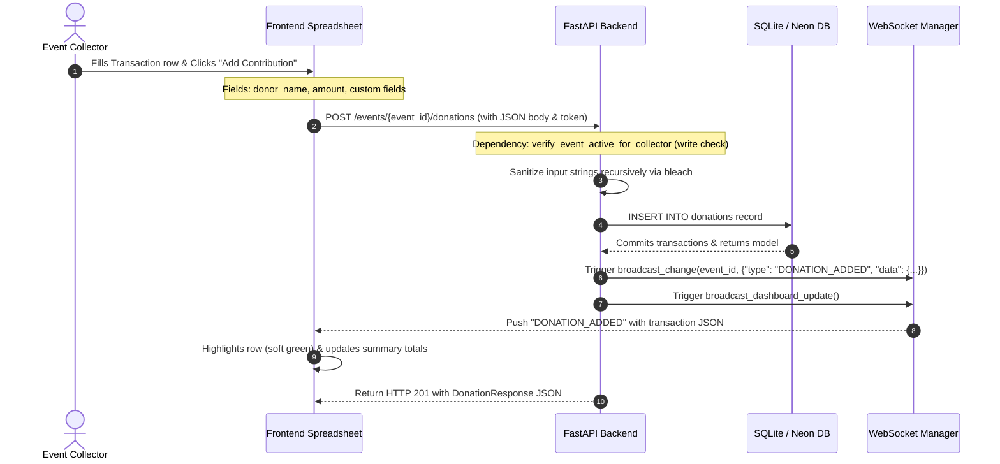

# Workflow: Logging Contributions

> [!IMPORTANT]
> **Code is the Source of Truth**: If this documentation differs from the implementation in the codebase, the implementation always wins.

*   **Frontend Action**: [frontend/event.html](../../frontend/event.html) (Script: `js/controllers/EventFinancialsController.js` -> `submitInlineEntry('don')`)
*   **FastAPI Router Endpoint**: [backend/routers/donations_expenses.py](../../backend/routers/donations_expenses.py) (Function: `add_donation()`)
*   **Database CRUD Layer**: [backend/crud.py](../../backend/crud.py) (Function: `create_donation()`, Sanitization: `sanitize_json_payload()`)
*   **WebSocket Broadcast Trigger**: [backend/ws_manager.py](../../backend/ws_manager.py) (Function: `broadcast_change()`)

---

## 🔄 Execution Sequence Diagram



---

## 🛠️ Detailed Component Actions

### 1. User Interaction (Frontend)
*   The collector navigates to the event's detailed page, opens the **Collections** tab, and clicks **Add Contribution** (or opens the entry form).
*   The user enters the donor name, payment amount, and dynamic custom field values (e.g. "T-Shirt: Medium").
*   The page controller [EventFinancialsController.js](../../frontend/js/controllers/EventFinancialsController.js) calls `submitInlineEntry('don')`.
*   The client calls `addDonation` inside [api.js](../../frontend/js/api.js), sending the request payload:
    ```json
    {
      "donor_name": "Jane Smith",
      "amount": 1500.00,
      "payment_received": true,
      "custom_fields": {
        "T-Shirt": "Medium"
      }
    }
    ```

### 2. API Routing (Backend)
*   The route `POST /events/{event_id}/donations` resolves inside [donations_expenses.py](../../backend/routers/donations_expenses.py).
*   Enforces a rate limit of 30 writes per user per minute.
*   Enforces the access guard dependency `verify_event_active_for_collector(..., for_write=True)`. This checks if the user is a member of the event and is not restricted, and if the event is active.

### 3. Database Mutations (CRUD)
*   The method `create_donation()` inside [crud.py](../../backend/crud.py):
    1.  Recursively sanitizes all text values in `custom_fields` and `donor_name` using `sanitize_json_payload(data)` to prevent stored XSS attacks.
    2.  Creates the `Donation` ORM instance and inserts it into the `donations` table.
    3.  Sets the `collected_by` column to the collector's user ID.
    4.  Commits the database transaction.

### 4. Cache & WebSocket Sync
*   **Cache Invalidation**: The backend invalidates the summary cache key `sum:{event_id}` in Redis.
*   **WebSocket Broadcast**: 
    *   Broadcasts `DONATION_ADDED` containing the JSON payload of the new transaction to the event channel, allowing all active users to see the new record in their tables.
    *   Broadcasts `DASHBOARD_UPDATE` to update the financial totals on the dashboard.
*   The frontend highlights the newly added row in green (`var(--row-new)`) and updates the summary totals.
