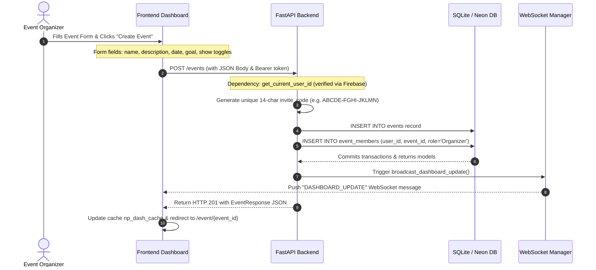

# Workflow: Create Event

> [!IMPORTANT]
> **Code is the Source of Truth**: If this documentation differs from the implementation in the codebase, the implementation always wins.

*   **Frontend Action**: [frontend/create-event.html](../../frontend/create-event.html) (Script: `js/create-event.js`)
*   **FastAPI Router Endpoint**: [backend/routers/events.py](../../backend/routers/events.py) (Function: `create_event()`)
*   **Database CRUD Layer**: [backend/crud.py](../../backend/crud.py) (Function: `create_event()`)
*   **Cache Invalidation**: [backend/cache.py](../../backend/cache.py) (Function: `bump_global_version()`)

---

## 🔄 Execution Sequence Diagram



---

## 🛠️ Detailed Component Actions

### 1. User Interaction (Frontend)
*   The organizer clicks the **Create Event** button in the sidebar (or navigates to `/create-event`).
*   The user fills out the form inside [create-event.js](../../frontend/js/create-event.js) and clicks submit.
*   The script validates the inputs (e.g., verifying that the name is at least 3 characters and the event date is set in the future).
*   The client calls `createEvent()` inside [api.js](../../frontend/js/api.js), sending the request payload:
    ```json
    {
      "name": "Annual Gathering",
      "description": "Shared cost ledger for family reunion",
      "event_date": "2026-10-15T12:00:00Z",
      "show_contributions": true,
      "show_expenses": true,
      "goal_amount": 25000
    }
    ```

### 2. API Routing (Backend)
*   The route `POST /events` resolves inside [events.py](../../backend/routers/events.py).
*   The API enforces a rate limit check (`verify_rate_limit(..., limit=5, window=60)`).
*   Calls `crud.create_event()`.

### 3. Database Mutations (CRUD)
*   The method `create_event()` inside [crud.py](../../backend/crud.py):
    1.  Generates a 14-character string code (e.g., `ABCDE-FGHI-JKLMN`).
    2.  Creates the `Event` ORM instance and inserts it into the `events` table.
    3.  Creates an `EventMember` instance with `role = UserRole.organizer` and links it to the creator's user ID.
    4.  Commits the database transaction.

### 4. Cache & WebSocket Sync
*   The backend calls `cache.cache.bump_global_version()`, incrementing the `dash_v` key in Redis.
*   Calls `manager.broadcast_dashboard_update()` to notify all active dashboard connections.
*   Clients receive the notification and refresh their dashboards, displaying the newly created event.
*   The browser redirects the organizer to the event's detailed page `/event/{event_id}`.
