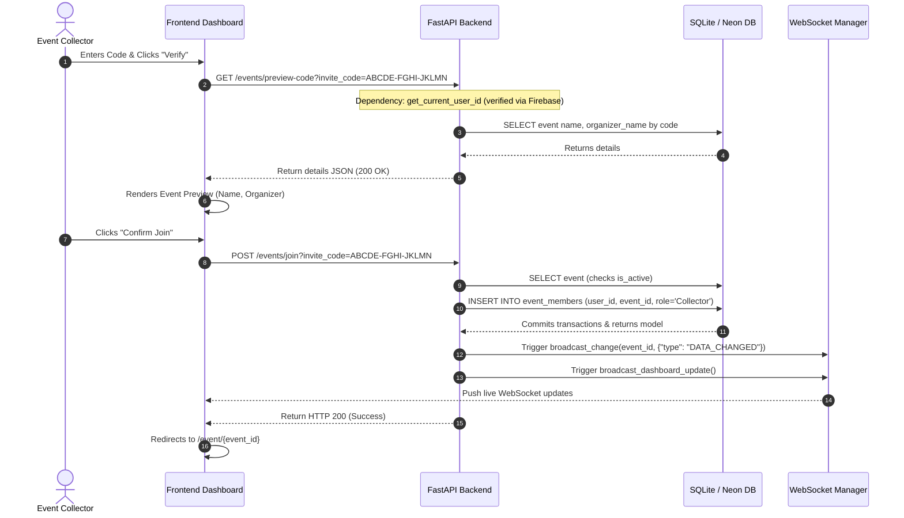

# Workflow: Join Event by Code

> [!IMPORTANT]
> **Code is the Source of Truth**: If this documentation differs from the implementation in the codebase, the implementation always wins.

*   **Frontend Action**: [frontend/join-event.html](file:///c:/Users/bodha/OneDrive/Documents/NOTEPAY/Notepay_App/frontend/join-event.html) (Script: `js/join-event.js`)
*   **FastAPI Router Endpoints**: [backend/routers/events.py](file:///c:/Users/bodha/OneDrive/Documents/NOTEPAY/Notepay_App/backend/routers/events.py) (Functions: `preview_invite_code()`, `join_event()`)
*   **Database CRUD Layer**: [backend/crud.py](file:///c:/Users/bodha/OneDrive/Documents/NOTEPAY/Notepay_App/backend/crud.py) (Function: `join_event()`)
*   **WebSocket Broadcast Trigger**: [backend/ws_manager.py](file:///c:/Users/bodha/OneDrive/Documents/NOTEPAY/Notepay_App/backend/ws_manager.py) (Functions: `broadcast_change()`, `broadcast_dashboard_update()`)

---

## 🔄 Execution Sequence Diagram

---

## 🛠️ Detailed Component Actions

### 1. User Interaction (Frontend)
*   The collector clicks **Join by Code** in the sidebar (or navigates to `/join`).
*   The collector enters the invite code (e.g. `ABCDE-FGHI-JKLMN`) and clicks verify.
*   The page controller [join-event.js](file:///c:/Users/bodha/OneDrive/Documents/NOTEPAY/Notepay_App/frontend/join-event.html) calls `previewEventCode()`.
*   Once validated, the user clicks **Confirm Join**, triggering `joinEvent()`.

### 2. API Routing (Backend)
*   **Preview Code**: Resolves at `GET /events/preview-code`. Enforces a rate limit of 100 previews per minute to prevent brute-force attacks.
*   **Join Route**: Resolves at `POST /events/join`. Enforces a rate limit of 5 joins per minute.

### 3. Database Mutations (CRUD)
*   The method `join_event()` inside [crud.py](file:///c:/Users/bodha/OneDrive/Documents/NOTEPAY/Notepay_App/backend/crud.py):
    1.  Queries the `events` table to find the record matching the `invite_code`.
    2.  Verifies the event is active. If deactivated, it returns an HTTP 403 error.
    3.  Checks the `event_members` table to see if the user is already joined.
    4.  If not joined, it inserts a new membership row with `role = UserRole.collector`.
    5.  Commits the database transaction.

### 4. Cache & WebSocket Sync
*   **Cache Invalidation**: The backend calls `cache.cache.invalidate_event(event_id)` and bumps the global dashboard version in Redis.
*   **Live Notifications**:
    *   Broadcasts `DATA_CHANGED` to the event channel, notifying the organizer and other active collectors that a new member has joined.
    *   Broadcasts `DASHBOARD_UPDATE` to update the event counts in members' sidebars.
*   The browser redirects the collector to the event's detailed page `/event/{event_id}`.
