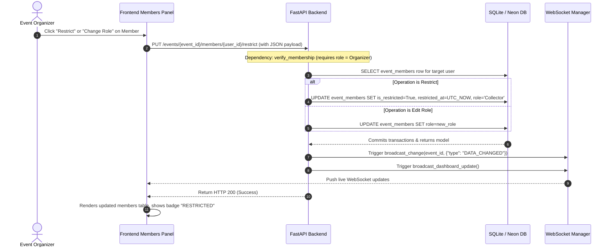

# Workflow: Member Role Management & Restrictions

> [!IMPORTANT]
> **Code is the Source of Truth**: If this documentation differs from the implementation in the codebase, the implementation always wins.

*   **Frontend Action**: [frontend/event.html](file:///c:/Users/bodha/OneDrive/Documents/NOTEPAY/Notepay_App/frontend/event.html) (Script: `js/controllers/EventMembersController.js`)
*   **FastAPI Router Endpoints**: [backend/routers/events.py](file:///c:/Users/bodha/OneDrive/Documents/NOTEPAY/Notepay_App/backend/routers/events.py) (Functions: `restrict_member()`, `unrestrict_member()`)
*   **Database CRUD Layer**: [backend/crud.py](file:///c:/Users/bodha/OneDrive/Documents/NOTEPAY/Notepay_App/backend/crud.py) (Function: `set_member_restriction()`)
*   **WebSocket Broadcast Trigger**: [backend/ws_manager.py](file:///c:/Users/bodha/OneDrive/Documents/NOTEPAY/Notepay_App/backend/ws_manager.py) (Functions: `broadcast_change()`, `broadcast_dashboard_update()`)

---

## 🔄 Execution Sequence Diagram

---

## 🛠️ Detailed Component Actions

### 1. User Interaction (Frontend)
*   The organizer navigates to the event's detailed page, opens the **Members** tab, and views the list of collaborators.
*   The organizer clicks **Restrict** on a collector (or selects a new role from a dropdown).
*   The page controller [EventMembersController.js](file:///c:/Users/bodha/OneDrive/Documents/NOTEPAY/Notepay_App/frontend/js/controllers/EventMembersController.js) triggers the update action.
*   The client calls the appropriate endpoint inside [api.js](file:///c:/Users/bodha/OneDrive/Documents/NOTEPAY/Notepay_App/frontend/js/api.js):
    *   Restrict: `PUT /events/{event_id}/members/{user_id}/restrict`
    *   Unrestrict: `PUT /events/{event_id}/members/{user_id}/unrestrict`

### 2. API Routing & Authorization Checks (Backend)
*   The routes resolve inside [events.py](file:///c:/Users/bodha/OneDrive/Documents/NOTEPAY/Notepay_App/backend/routers/events.py).
*   Enforces the access guard dependency `verify_membership(db, event_id, user_id, require_organizer=True)`. This ensures that only the event organizer can change roles or restrict members.

### 3. Database Mutations (CRUD)
*   The method `set_member_restriction()` inside [crud.py](file:///c:/Users/bodha/OneDrive/Documents/NOTEPAY/Notepay_App/backend/crud.py):
    1.  Queries the `event_members` table to find the record matching the `event_id` and target `user_id`.
    2.  Updates `is_restricted` to `True` (or `False` on unrestrict).
    3.  Sets the `restricted_at` timestamp.
    4.  Updates the user's role to `UserRole.collector` (restricted members cannot hold organizer roles).
    5.  Commits the database transaction.

### 4. Cache & WebSocket Sync
*   **Cache Invalidation**: The backend invalidates the summary cache key `sum:{event_id}` and bumps the global dashboard version in Redis.
*   **WebSocket Broadcast**: 
    *   Broadcasts `DATA_CHANGED` to the event channel. Active clients fetch updated member data in the background.
    *   Broadcasts `DASHBOARD_UPDATE` to update event details for connected clients.
*   **Permissions Invalidation**: If the restricted user is currently online, their next write operation will trigger a 403 Forbidden error because their database membership record is now marked as restricted.
