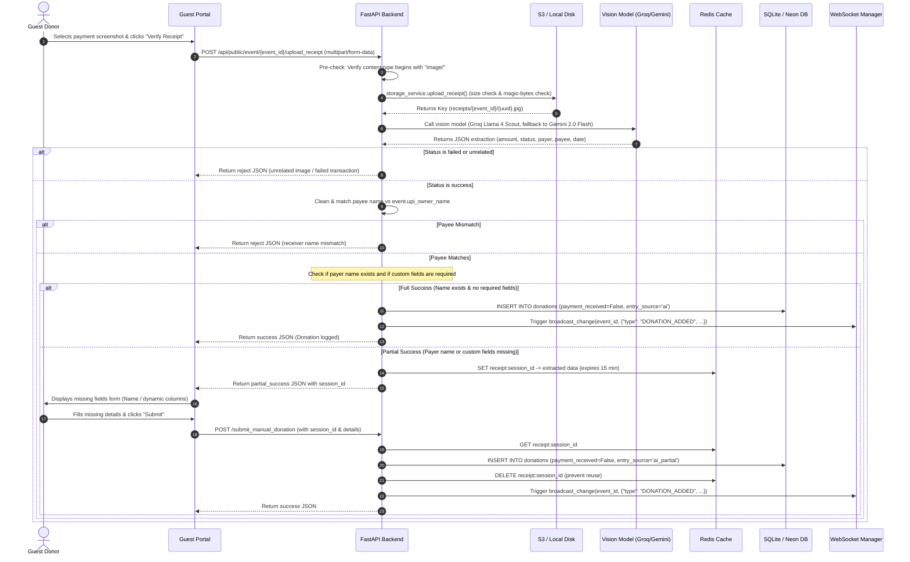

# Workflow: AI UPI Receipt Verification

> [!IMPORTANT]
> **Code is the Source of Truth**: If this documentation differs from the implementation in the codebase, the implementation always wins.

*   **Frontend Action**: [frontend/contribute.html](../../frontend/contribute.html)
*   **FastAPI Router Endpoints**: [backend/routers/public.py](../../backend/routers/public.py) (Functions: `upload_receipt()`, `submit_manual_donation()`)
*   **Magic Byte Image Scanner**: [backend/storage.py](../../backend/storage.py) (Function: `validate_receipt_content()`)
*   **Vision AI Parser Fallback**: [backend/routers/public.py](../../backend/routers/public.py) (Function: `extract_receipt_data_with_fallback()`)
*   **WebSocket Broadcast Trigger**: [backend/ws_manager.py](../../backend/ws_manager.py) (Function: `broadcast_change()`)

---

## 🔄 Execution Sequence Diagram

---

## 🛠️ Detailed Component Actions

### 1. Ingestion & Storage Validation
*   The donor uploads a UPI payment screenshot to the guest portal.
*   The client calls `upload_receipt` in [public.py](../../backend/routers/public.py).
*   **Pre-Check**: Validates that the file type is an image before reading the body.
*   **File Constraints**: Enforces a strict 5MB maximum limit.
*   **Magic Byte Signature Verification**: The system inspects the file's first bytes (magic numbers) to verify it is a valid JPEG, PNG, GIF, or WEBP image, blocking malicious payloads or non-image types.
*   **Storage**: Saves the file to S3 (production) or local uploads directory (local development).

### 2. Vision AI Extraction & Failover
*   The backend calls the Groq Vision model `meta-llama/llama-4-scout-17b-16e-instruct` first, checking multiple API keys to handle rate limits.
*   If Groq fails, the pipeline calls Google's `gemini-2.0-flash` model.
*   If both models fail, the system falls back to manual entry, returning a `receipt_session_id` and cached receipt key to allow the user to input details manually.

### 3. Verification Gates
*   **Receiver Verification**: Cleans and checks words inside the receipt's extracted `receiver_name` against the registered `upi_owner_name` on the event. If no matching words are found, the upload is rejected.
*   **Transaction Status**: Rejects screenshots with status `failed`, `pending`, or `unrelated_image`.
*   **Data Completion Gate**:
    *   **Full Success**: If the payer's name is extracted and the event has no custom columns marked as `reqByDonor` (required by donor), the transaction is written immediately as a donation with `payment_received=False` (unreconciled status), and WS clients are notified.
    *   **Partial Success**: If the payer's name is missing or the event contains columns the donor must fill out, a temporary session is cached in Redis for 15 minutes. The user is prompted to enter their name or missing fields to complete the donation.
