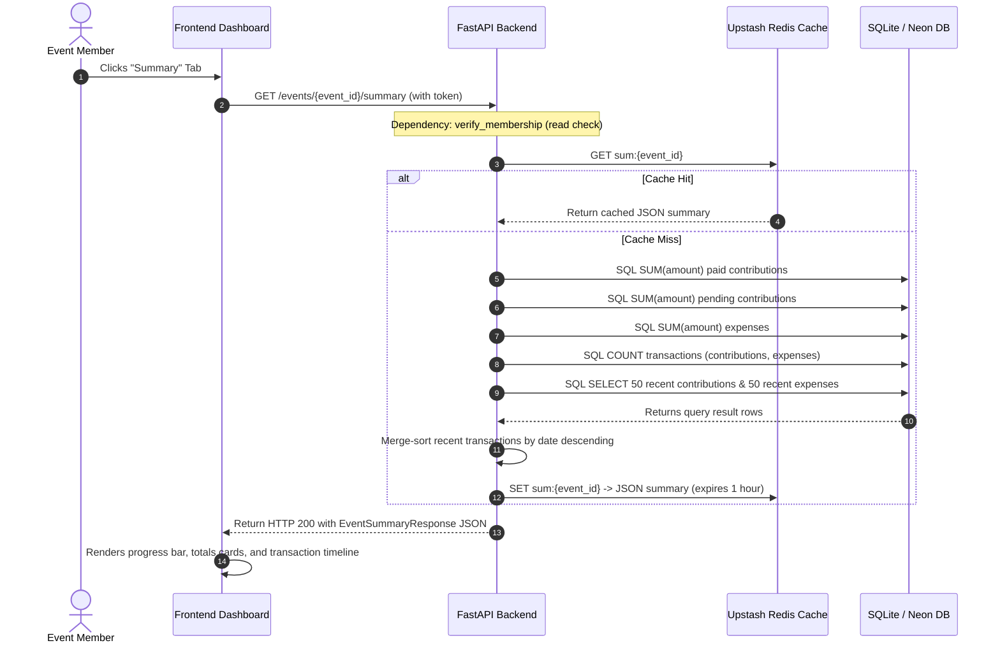

# Workflow: Financial Summaries

> [!IMPORTANT]
> **Code is the Source of Truth**: If this documentation differs from the implementation in the codebase, the implementation always wins.

*   **Frontend Tab Switching**: [frontend/event.html](file:///c:/Users/bodha/OneDrive/Documents/NOTEPAY/Notepay_App/frontend/event.html) (Script: `js/controllers/EventFinancialsController.js` -> `switchTab()`)
*   **FastAPI Router Endpoint**: [backend/routers/contributions_expenses.py](file:///c:/Users/bodha/OneDrive/Documents/NOTEPAY/Notepay_App/backend/routers/contributions_expenses.py) (Function: `get_event_summary()`)
*   **Database Aggregations CRUD**: [backend/crud.py](file:///c:/Users/bodha/OneDrive/Documents/NOTEPAY/Notepay_App/backend/crud.py) (Function: `get_event_summary()`)
*   **Redis Caching Key**: `sum:{event_id}` in [backend/cache.py](file:///c:/Users/bodha/OneDrive/Documents/NOTEPAY/Notepay_App/backend/cache.py)

---

## 🔄 Execution Sequence Diagram

---

## 🛠️ Detailed Component Actions

### 1. User Interaction (Frontend)
*   The user accesses the event's detailed page and clicks the **Summary** tab.
*   The controller [EventFinancialsController.js](file:///c:/Users/bodha/OneDrive/Documents/NOTEPAY/Notepay_App/frontend/js/controllers/EventFinancialsController.js) triggers a load request.
*   The client calls `getSummary()` inside [api.js](file:///c:/Users/bodha/OneDrive/Documents/NOTEPAY/Notepay_App/frontend/js/api.js).

### 2. API Routing (Backend)
*   The route `GET /events/{event_id}/summary` resolves inside [contributions_expenses.py](file:///c:/Users/bodha/OneDrive/Documents/NOTEPAY/Notepay_App/backend/routers/contributions_expenses.py).
*   Enforces the access guard dependency `verify_membership()`. Banned or restricted members cannot access the summary.

### 3. Caching & Database Aggregations (CRUD)
*   The method `get_event_summary()` inside [crud.py](file:///c:/Users/bodha/OneDrive/Documents/NOTEPAY/Notepay_App/backend/crud.py):
    1.  Checks if a cached summary exists in Redis under the key `sum:{event_id}`. If a cache hit occurs, it returns the cached data immediately.
    2.  If a cache miss occurs, the backend executes SQL aggregates to calculate financial totals:
        *   `total_contributions`: `SUM(amount)` where `payment_received != False`.
        *   `total_to_collect`: `SUM(amount)` where `payment_received == False`.
        *   `total_expenses`: `SUM(amount)`.
    3.  Queries the database for the 50 most recent contributions and 50 most recent expenses.
    4.  Merge-sorts both lists by date descending in memory, keeping only the top 50 most recent transactions.
    5.  Saves the compiled summary JSON in Redis under the key `sum:{event_id}` (configured with a 1-hour expiry).
    6.  Returns the summary data.

### 4. UI Rendering (Frontend)
*   The frontend uses the summary data to render:
    *   **Totals Cards**: Displaying Total Collected, Total Expenses, and Remaining Balance.
    *   **Progress Bar**: Visually displays the collected amount compared to the event's target goal.
    *   **Transaction Timeline**: Displays the combined list of recent transactions, showing the date, collector, amount, and payment status.
